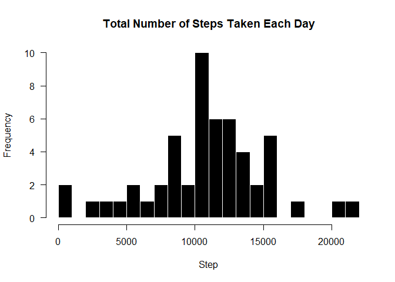
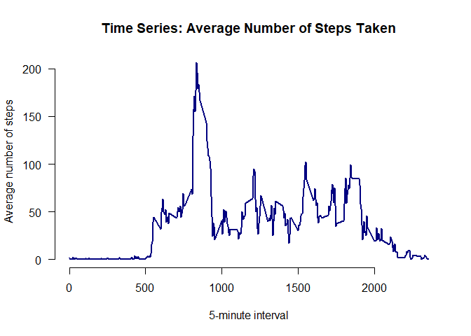
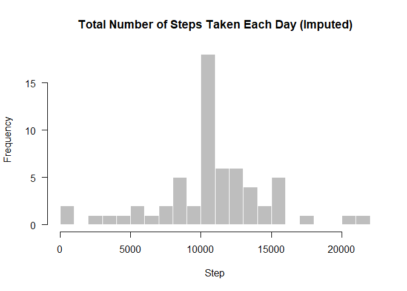
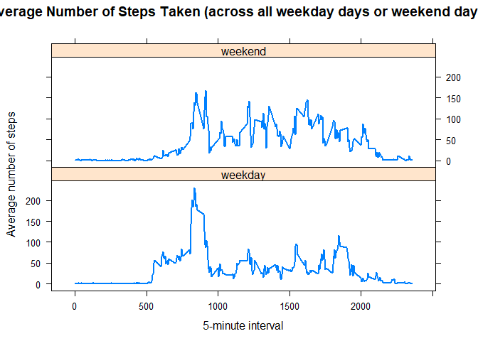

##loading necessary libraries

```r
library(ggplot2)

library(scales)

library(Hmisc)
```

## Loading and preprocessing the data

```r
activity <- read.csv("activity.csv")
activity$date <- as.Date(activity$date, format = "%Y-%m-%d")
```


## What is mean total number of steps taken per day?

```r
total_step <- aggregate(steps ~ date, data = activity, sum, na.rm = TRUE)
par(mfrow = c(1, 1))
```

#### use base plotting system and more bins than the default setting to plot a histogram

```r
hist(total_step$steps, breaks = 20, 
     main = "Total Number of Steps Taken Each Day",
     col = "black", border = "white", xlab = "Step", axes = FALSE)
axis(1)
axis(2, las = 1)
```

<!-- -->


#### mean and meadian of steps


```r
mean(total_step$steps)
```

```
## [1] 10766.19
```

```r
median(total_step$steps)
```

```
## [1] 10765
```


## What is the average daily activity pattern?


##### 1. Make a time series plot


```r
avg_step <- aggregate(steps ~ interval, data = activity, mean, na.rm = TRUE)
plot(avg_step$interval, avg_step$steps, type = "l", lwd = 2, col = "navy",
     main = "Time Series: Average Number of Steps Taken", axes = FALSE,
     xlab = "5-minute interval", ylab = "Average number of steps")
axis(1)
axis(2, las = 1)
```

<!-- -->


##### 2. Which 5-minute interval, on average across all the days in the dataset, contains the maximum number of steps?


```r
 avg_step$interval[which.max(avg_step$steps)]
```

```
## [1] 835
```


## Imputing missing values


##### 1. Calculate and report the total number of missing values in the dataset 


```r
numMissingValues <- sum(is.na(activity))
```


* Number of missing values are  2304


##### 2. Devise a strategy for filling in all of the missing values in the dataset.here the mean is being used to fill in the for missing values


##### 3. Create a new dataset that is equal to the original dataset but with the missing data filled in.


```r
new <- activity # new dataset called new
for (i in avg_step$interval) {
    new[new$interval == i & is.na(new$steps), ]$steps <- 
        avg_step$steps[avg_step$interval == i]
}
```


##### 4. Make a histogram of the total number of steps taken each day 


```r
total_step_new <- aggregate(steps ~ date, data = new, sum, na.rm = TRUE)
hist(total_step_new$steps, breaks = 20, 
     main = "Total Number of Steps Taken Each Day (Imputed)",
     col = "grey", border = "white", xlab = "Step", axes = FALSE)
axis(1)
axis(2, las = 1)
```

<!-- -->


##### 5.Calculate and report the mean and median total number of steps taken per day. 


```r
stepsByDayMeanImputed <- mean(total_step_new$steps)

stepsByDayMedianImputed <- median(total_step_new$steps)
```

* Mean (Imputed) is 1.0766189\times 10^{4}

* Median (Imputed) is  1.0766189\times 10^{4}


#### The mean is the same as the mean from the first dataset , but the median is not, but their values are close. Imputing missing data using the mean of the 5-minute interval results in more data points equal to the mean and smaller variation of the distribution. Since many data points have the same values as the mean, the median is much likely to be the same as the mean.


## Are there differences in activity patterns between weekdays and weekends?


##### 1. Create a new factor variable in the dataset with two levels - "weekday" and "weekend" indicating whether a given date is a weekday or weekend day.


```r
new$day <- weekdays(new$date)
new$week <- ""
new[new$day == "Saturday" | new$day == "Sunday", ]$week <- "weekend"
new[!(new$day == "Saturday" | new$day == "Sunday"), ]$week <- "weekday"
new$week <- factor(new$week)
```


##### 2. Make a panel plot containing a time series plot (i.e. type = "l") of the 5-minute interval (x-axis) and the average number of steps taken, averaged across all weekday days or weekend days (y-axis). The plot should look something like the following, which was created using simulated data


```r
avg_step_new <- aggregate(steps ~ interval + week, data = new, mean)
library(lattice)
xyplot(steps ~ interval | week, data = avg_step_new, type = "l", lwd = 2,
       layout = c(1, 2), 
       xlab = "5-minute interval", 
       ylab = "Average number of steps",
       main = "Average Number of Steps Taken (across all weekday days or weekend days)")
```

<!-- -->
